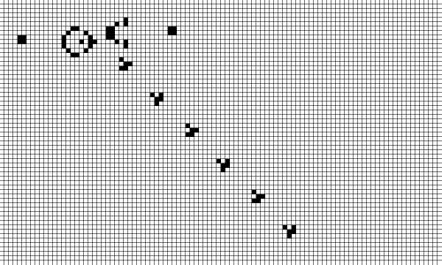

# Conway's Game of Life

## Description

Implementation of [Conway's Game of Life](https://web.archive.org/web/20090603015231/http://ddi.cs.uni-potsdam.de/HyFISCH/Produzieren/lis_projekt/proj_gamelife/ConwayScientificAmerican.htm) in C++ using the SFML graphics library.

## Installation

### Dependencies

The only nonstandard dependency is [SFML](https://www.sfml-dev.org/), a graphics library for rendering in C++

### Makefile

The executable is built with g++ to a file named `gameoflife`, via the `make` command.

`make clean` will clear any object and executable files lingering, as well as resetting the output image.

## Usage

Once built, run the executable with `./gameoflife`.

The game simulation is run with:
- The right arrow key, advancing one step
- The space button (hold), advancing one step every frame (60x per second)
- The "Q" key exits the game

Interaction with the playing field is as follows:
- Left mouse button (click) will toggle a cell
- Right mouse button (hold) will "paint" as long as it is held, changing to the opposite of the cell initially clicked
- The "C" or "R" key will clear the field

## TODOs

- Wrapped boundaries
- Automatic boundary extension
