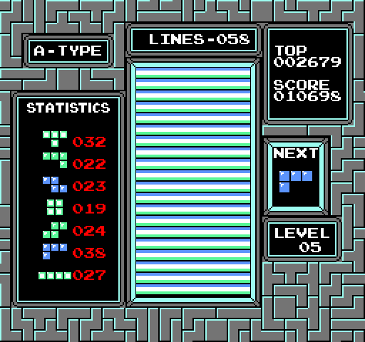

# Classic NES Tetris

## Description

Recreation of the NES Tetris game in C++ using the SFML graphics library.

## Installation

### Dependencies

The only nonstandard dependency is [SFML](https://www.sfml-dev.org/), a graphics library for rendering in C++

### Makefile

The executable is built with g++ to a file named `tetris`, built with `make`.
`make clean` will clear any object and executable files lingering, as well as resetting the highscore and output image.

## Usage

Once built, run the executable with `./tetris`.

Gameplay is relatively simple:
- The game starts at level 0, and increases once per 10 lines
- To increase the drop speed, hold the down arrow key
- To shift left or right, tap or hold the respective arrow key
- To rotate clockwise, press "z"
- To rotate counterclockwise, press "x"
- To exit the game, press "q"

If unsure about rules or gameplay, refer to the [NES classis tetris manual](https://www.retrogames.cz/manualy/NES/Tetris_(Nintendo)_-_NES_-_Manual.pdf)

## TODOs

- Add title screen
- Add victory screen
- Limit integer values to their maximum digit count
- Add sound effects