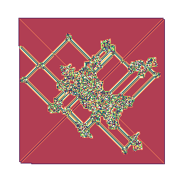

# Langton's Ant

## Description

Simulation of [Langton's Ant](https://en.wikipedia.org/wiki/Langton%27s_ant), a cellular automaton in which
an ant "walks" over a 2D space, acting based on the tile at it's position.

The field is initialized to zeros, and incremented when the ant walks on that tile.
The values wrap around when they hit a given maximum.

The ant then acts based on the value of the tile, either turning right, left, around, or not at all.
The ant then takes a single step "forwards", and the cycle repeats.

This has shown to create interesting patterns which depend on the number of values in the field, and the decision of the ant.
The below output was created by simulating 250,000 iterations with the default pattern.

## Installation

### Dependencies

There are currently no dependencies of the program.
The argument parsing is done natively through `getopt`,
and the output is also native through primitive FileIO

### Makefile

The executable is built with gcc to a file named `simulate`, via the `make` command.

`make clean` will clear any object and executable files lingering, as well as resetting the output image.

## Usage

The program takes a several arguments:
- `-i int` is the maximum iteration limit. If the ant reaches the outer bounds of the grid before that capacity is reached, the program will terminate early.
- - `default: 250_000`
- `-x int` is the width of the simulation.
- - `default: 256`
- `-y int` is the height of the simulation. 
- - `default: 256`
- `-o string` is the name of the output image file, and should end in `.bmp`
- - `default: "output/output.bmp"
- `-p string` is the pattern to follow. The length determines the number of states for the field, and each value can be one of 'R', 'U', 'L', or 'N' for 90, 180, 270, and 360 degrees clockwise respectively.
- - `default: "LRRRRRLLR"`

## TODOs

