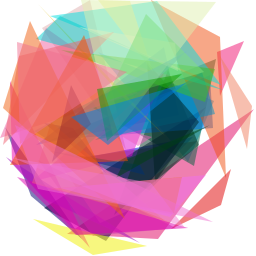

# Triangle Image Evolution

## Description

Starting from a random initial state, triangles are mutated randomly and if the resulting image is more similar to the target, the altered set of triangles is saved and the process is repeated.

 

## Installation

### Dependencies

The only nonstandard dependency is the [cairo graphics library](https://cairographics.org/)

### Makefile

The executable is built with gcc to a file named `generate`, via the `make` command.

`make clean` will clear any object and executable files lingering, as well as resetting the output image.

## Usage

Once built, run the executable with `./generate`, and any of the following arguments:
- `-n int`: the number of triangles to use for the evolution
- - `default: 50`
- `-i int`: the total number of iterations
- - `default: 100000`
- `-p int`: the number of iterations in between each print step
- - `default: 100`

## TODOs

- Add multiple different possible evolution modes
- Add a random exploration with probability $\epsilon$
- Implement inverted RMSE as alternate fitness
- Compute fitness in YCC (Luma and Chroma) space
