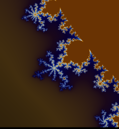

# Julia Set Fractal Renderer
## Written in Julia

## Description

An interactive viewer for the Julia Set rendered through SFML, thanks to [CSFML.jl, a Julia wrapper for the C wrapper for the C++ API for SFML](https://github.com/JuliaMultimedia/CSFML.jl)

## Installation

### Dependencies

This project depends on `CSFML.jl`, a Julia library which ports the C-SFML api.
To install it, enter `]add CSFML` into the Julia REPL.

## Usage

To start the viewer, load the `FractalRender.jl` file,
through the REPL with `include("FractalRender.jl")`,
or through the Command Line with `julia FractalRender.jl`.

## TODOs

- ~~Move computation to the GPU~~ (Not possible with CSFML)

