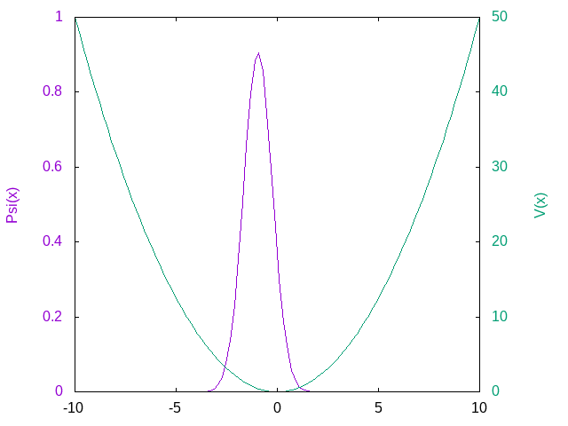

# Split-Step Fourier Method NLSE Solver

Solver for the Nonlinear Schrodinger equation using the split-operator method as described [in the algorithm archive](https://www.algorithm-archive.org/contents/split-operator_method/split-operator_method.html), with a strictly non-object oriented style

The wavefunction, trapping function, and timestep (real or imaginary) are all configurable at the top level.
Besides finding the lowest energy state of the system, the code also generates a gif animation of the wavefunction through time

