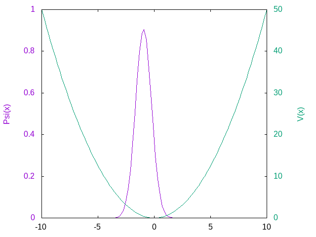

# Split-Step Fourier Method NLSE Solver

## Description

Solver for the Nonlinear Schrodinger equation using the split-operator method as described [in the algorithm archive](https://www.algorithm-archive.org/contents/split-operator_method/split-operator_method.html), with a strictly non-object oriented style

The wavefunction, trapping function, and timestep (real or imaginary) are all configurable at the top level.
Besides finding the lowest energy state of the system, the code also generates a gif animation of the wavefunction through time

## Usage

### SSFM

Run `python3 ./splitop.py` to execute the script, which will save the data to the output/ folder
Configurable variables are at the top of the script:
- `XMIN` and `XMAX` control the width of the simulation "box"
- `RES` controls the resolution of the simulation
- `STEP_SIZE` controls the size of the timestep for the simulation. Lower timestep gives more accuracy, but takes longer
- - To toggle groundstate simulations, add/remove the `-1j` constant ($-\sqrt-1$) multiplied with the `STEP_SIZE`'
- `TIMESTEPS` controls the number of iterations to make. If `STEP_SIZE` is decreased for accuracy, it's probably a good idea to increase `TIMESTEPS` accordingly

Some operators can also be configured. Namely,
- The trapping potential operator `V` can be any trapping function of X, often a polynomial of even degree and positive leading coefficient.
- - The trapping potential defaults to a simple parabola
- The wavefunction `WFC` can also be any function of X, often a spiking function to settle nicely with the trapping potential
- - The wavefunction defaults to a simple shifted gaussian function

### Plotting

Once the data has been generated, the included `plot.plt` [gnuplot](http://www.gnuplot.info/) script can be run to generate the animation shown above
To run it, just call the script with gnuplot: `gnuplot plot.plt`.
The output will be placed in the `output/` folder alongside the generated data files

## TODOs

- Multiple choices for solver backend:
- - Fourth Order Runge-Kutta (RK4)
- - Crank-Nicolson
- - Iterative Fleck
- - Operator Exponential Scheme
- Argument parser for simple arguments (not operators)
- Iterative timestep tuning
