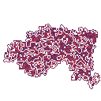
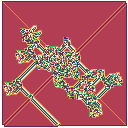

# Skunkworks

# C

## [Triangle Image Evolution](C/Triangle-Image-Evolution/)
  

## [Langton's Ant](C/Langtons-Ant/)
 

# C++

## [Conway's Game of Life implementation](C++/Game-of-Life/)

## [NES Tetris](C++/Tetris/)

## [Cards and Shuffle simulations](C++/ShuffleSim/)

# Julia

## [Arbitrary Precision Arithmetic on the GPU](Julia/BigIntGPU/)

## [Julia Set Renderer](Julia/Fractal-Render/)

# Python

## [Noise Algorithms](Python3/Noise/)

## [Split-Step Fourier Method NLSE solver](Python3/Split-Operator-Solver/)

## [Video to Ascii converter](Python3/video2ascii/)

## [ResNet-18 Implementation](Python3/ResNet-18/)

## [Image Compression with Convolutional Autoencoders](Python3/Conv-Autoencoder/)

## [UTSC Available Room Finder](Python3/UTSC-Room-Finder/)

